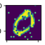
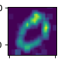

# SpiNNaker_Conv
To make a connectionList between two populations when applying a convolution kernel.

The notebook shows an application to see how to apply a custom filter.

Here is an input from MNIST when some salt and paper noise is added:

And here is the output after converting the image into spikes and passing it through the network :

